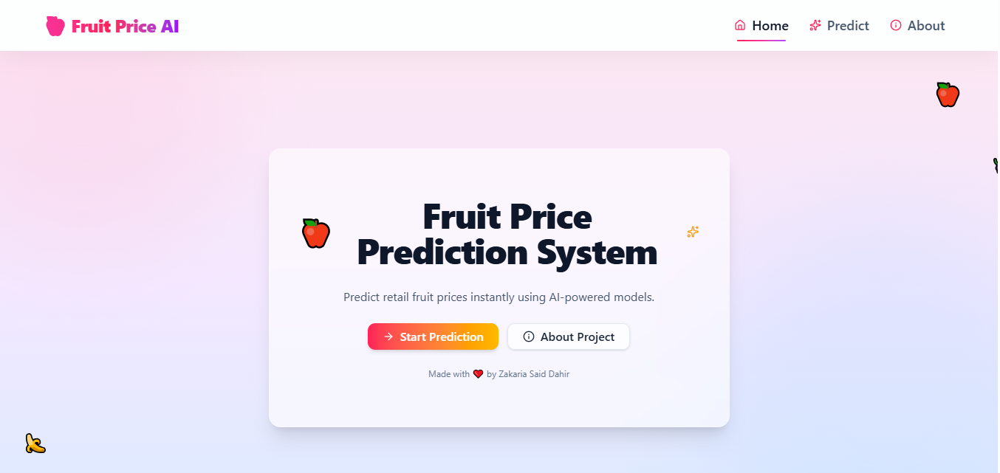
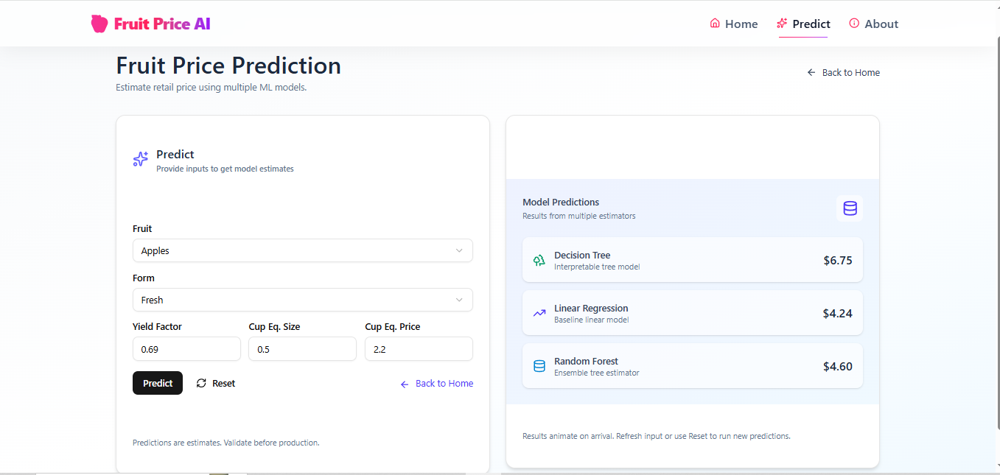
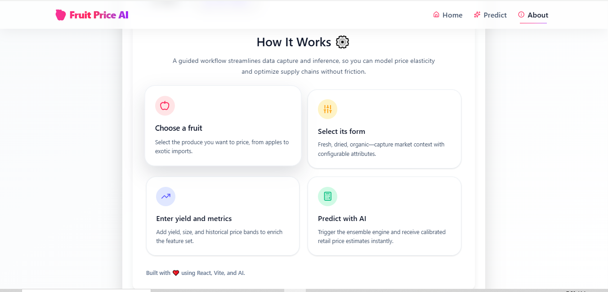

# Fruit Price AI

Predict retail fruit prices with an interactive React frontend backed by a FastAPI microservice and pre-trained scikit-learn models. The application is live at [https://fruit-prices-app.vercel.app](https://fruit-prices-app.vercel.app) with the API hosted separately on Render.

## Features

- Multi-model predictions (Random Forest, Linear Regression, Decision Tree) exposed through a unified `/predict` endpoint.
- Fuzzy fruit-name matching that tolerates typos and normalizes user inputs before inference.
- Animated, mobile-ready UI built with React 19, Vite, Tailwind CSS v4, shadcn/ui primitives, and Framer Motion.
- Environment-controlled deployments with CORS protection between the Vercel frontend and Render API.
- Pre-bundled feature scaler, label encoder, and model artifacts for reproducible local predictions.

## Screenshots







## Tech Stack

- **Frontend:** React 19, Vite, TypeScript, Tailwind CSS 4, Radix UI, shadcn/ui, Framer Motion, Axios, React Router.
- **Backend:** FastAPI, Uvicorn, scikit-learn, NumPy, joblib, python-dotenv.
- **Models:** Random forest, linear regression, and decision tree regressors trained offline and serialized as `.pkl` artifacts under `backend/models`.

## Project Structure

```text
backend/
  app/
		main.py              # FastAPI app with prediction endpoints and fuzzy matching
  models/                # Trained estimators, scaler, encoder
  requirements.txt       # Python dependencies
client/
  src/                   # React SPA with Home, Predict, About pages
  vite.config.ts         # Vite + Tailwind configuration
  package.json           # Frontend dependencies and scripts
```

## Prerequisites

- Python 3.13 (or the version used to build the bundled virtual environment)
- Node.js 20+ (required by React 19 and Vite 5/rolldown)
- npm or pnpm/yarn for frontend package management

## Backend Setup

1. Navigate to `backend/`.
2. (Optional) Create and activate a virtual environment.
3. Install dependencies:

	```bash
	pip install -r requirements.txt
	```

4. Configure environment variables (see below). A sample `.env` already exists.
5. Start the API:

	```bash
	uvicorn app.main:app --reload --port 8000
	```

6. Open <http://localhost:8000/docs> for the interactive Swagger UI.

## Frontend Setup

1. Navigate to `client/`.
2. Install dependencies:

	```bash
	npm install
	```

3. Provide the API base URL via `VITE_API_URL` (see below).
4. Start the development server:

	```bash
	npm run dev
	```

5. Visit the Vite dev server (usually <http://localhost:5173>) in your browser.

## Environment Variables

| Location      | Variable        | Purpose                                      | Example                               |
| ------------- | ---------------- | -------------------------------------------- | -------------------------------------- |
| `backend/.env` | `FRONTEND_URL`   | Allowed origin for CORS.                     | `http://localhost:5173` or production URL |
| `client/.env`  | `VITE_API_URL`   | Base URL for the FastAPI server.             | `http://localhost:8000` or Render URL     |

Make sure the frontend and backend point to each other appropriately in local and production environments.

## API Reference

Base URL: `http://localhost:8000` (development) or the Render deployment.

- `GET /` – Health check and metadata.
- `GET /fruits` – Returns the list of normalized fruit names supported by the encoder.
- `POST /predict` – Run price predictions.

Request body example:
```json
{
	"fruit": "Apples",
	"form_Dried": false,
	"form_Fresh": true,
	"form_Frozen": false,
	"form_Juice": false,
	"yield_factor": 0.85,
	"cup_eq_size": 1.5,
	"cup_eq_price": 2.5
}
```

Response example:

```json
{
	"matched_fruit": "Apples",
	"predictions": {
		"RandomForest": 2.68,
		"LinearRegression": 2.44,
		"DecisionTree": 2.59
	}
}
```

The backend automatically scales numeric features, encodes the fruit selection, and applies each model. If a fruit name is misspelled, a fuzzy match is attempted before failing with a 400 error.

## Deployment

- **Frontend:** Vercel at [fruit-prices-app.vercel.app](https://fruit-prices-app.vercel.app)
- **Backend:** Render (e.g., `https://fruit-prices-web.onrender.com`)

Update the respective `.env` files before rebuilding so that CORS and API requests target the correct hosts.

## Future Improvements

- Add automated tests covering preprocessing and API contracts.
- Extend the model registry with additional estimators or retraining notebooks.
- Provide provenance for the training dataset and data update workflow.

## License

Specify the project license here if applicable.

